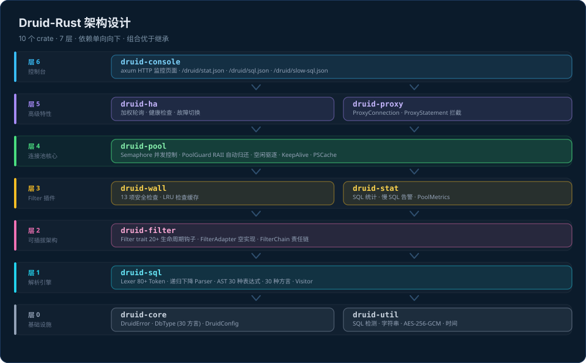
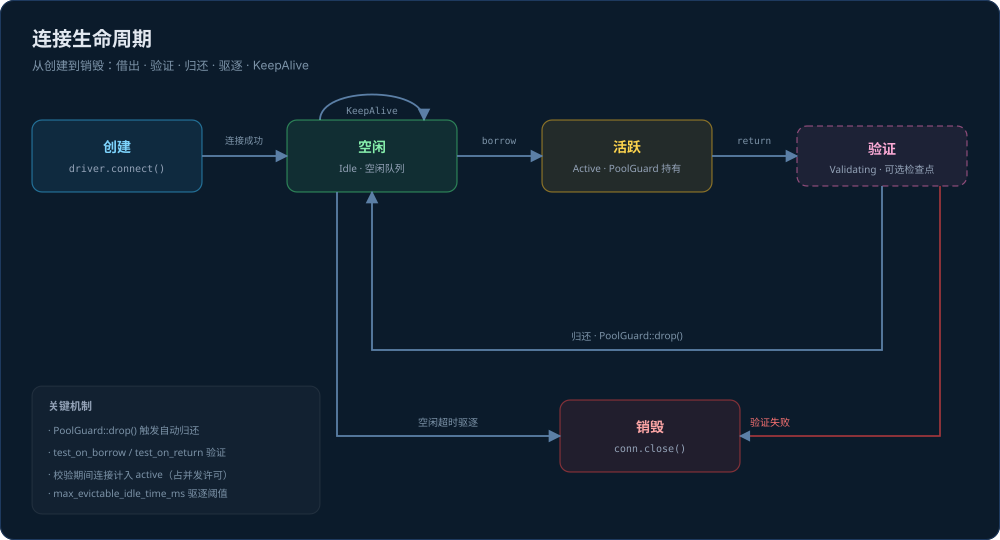
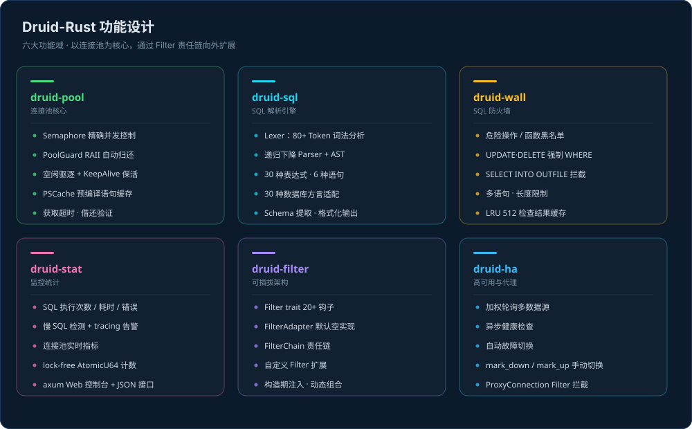

# Druid-Rust

[](LICENSE)
[]()

<p align="center">
  
</p>

[中文文档](../README.md) | English

**Druid-Rust** is a Rust port of [Alibaba Druid](https://github.com/alibaba/druid) — a high-performance, monitorable database connection pool with integrated SQL parsing, security firewall, and statistics.

## Project Mascot · Xiao De

**Xiao De** (the Druid Owl) is the project's mascot — an owl wearing a druid's hood. Its three traits map onto the three pillars of the project:

| Trait | Capability |
|-------|------------|
| 🦉 Never sleeps | **Statistics** (druid-stat) — every SQL call's count, latency and slow queries |
| 🌿 Druid hood | **Security** (druid-wall) — AST-level SQL firewall against injection and dangerous statements |
| 💧 Perched on the pool | **Connection pooling** (druid-pool) — pooled reuse, borrow and return |

The owl also appears in the Web console header: `druid-console` inlines the same
[`assets/mascot.svg`](assets/mascot.svg) via `include_str!`, and serves it at `/druid/mascot.svg` as the favicon.

> The diagrams below use Chinese labels with English identifiers, matching the primary README.

## Table of Contents

- [Project Mascot · Xiao De](#project-mascot--xiao-de)
- [Architecture](#architecture)
  - [Layered Design](#layered-design)
  - [Connection Lifecycle](#connection-lifecycle)
- [Project Structure](#project-structure)
- [Features](#features)
- [Quick Start](#quick-start)
- [Usage Guide](#usage-guide)
- [Configuration Reference](#configuration-reference)
- [Java to Rust Migration](#java-to-rust-migration)
- [Development & Testing](#development--testing)
- [Review Report](#review-report)

## Architecture



### Layered Design

Ten crates in seven layers. Dependencies point strictly downward — an upper layer may
depend on a lower one, never the reverse. `druid-pool` is the core; the other crates
surround it with parsing, protection, observability and operations.

### Design Principles

**1. Async-First**
- Built on `tokio` runtime, fully asynchronous I/O
- `Semaphore`-based non-blocking concurrency control with timeout
- Background eviction and KeepAlive driven by `tokio::spawn`

**2. Composition over Inheritance**
- Java class hierarchy → Rust `trait` + `struct` composition
- `Filter` trait with 18 lifecycle hooks, default no-op implementations
- `dyn Filter` trait objects for pluggable filter chains

**3. Type Safety**
- `DbType` enum covers 30 database dialects exhaustively
- `SQLStatement`/`SQLExpr` as algebraic data types
- `DruidError` via `thiserror`, preserving error type information

**4. Zero-Cost Abstractions**
- AOT-compiled native binary, no JIT warmup
- `PoolGuard` RAII — zero-overhead automatic connection return
- Monomorphization eliminates dynamic dispatch overhead

### Data Flow

```
User code
  │
  ▼
DruidDataSource.get_connection()     ← Semaphore permit
  │
  ├─► FilterChain.connection_borrowed()   ← WallFilter/StatFilter
  │
  ▼
PoolGuard (connection in use)        ← Pooled connection
  │
  ├─► PoolGuard::execute()/query()   ← the only guard path where SQL reaches the FilterChain
  │                                     (`guard.connection()` bypasses it)
  ▼
PoolGuard::drop()                    ← RAII auto-return
  │
  ├─► FilterChain.connection_returned()
  │
  ▼
Idle queue ← Wait for next borrow or eviction

Background (tokio::spawn):
  • Evictor:  Periodic idle connection cleanup
  • KeepAlive: Periodic idle connection validation
```

### Connection Lifecycle



| State | Entered via | Notes |
|-------|-------------|-------|
| **Creating** | `init()` warm-up / on-demand when the pool is empty | Calls `Driver::connect()` |
| **Idle** | Connect succeeded / connection returned | Queued in an idle `VecDeque` |
| **Active** | Borrowed by `get_connection()` | Held by `PoolGuard`; RAII guarantees return |
| **Validating** | `test_on_borrow` / `test_on_return` / KeepAlive | Optional checkpoint; failure destroys the connection. The connection stays **counted as active** for the whole validation window (both return-validation and KeepAlive) — visible to metrics and `close()` |
| **Destroyed** | `close()` / validation failure / idle timeout eviction | Calls `Connection::close()` |

- **Return**: `PoolGuard` returns the connection on `drop` — no explicit release needed, and a poisoned
  lock is recovered via `unwrap_or_else(|e| e.into_inner())`, so a panic does not leak the connection.
- **Eviction**: connections idle longer than `max_evictable_idle_time_ms` (and leaving the pool above `min_idle`)
  are reclaimed by the background Evictor.
- **KeepAlive**: with `keep_alive` enabled, a background task `ping`s idle connections so database-side or
  middleware timeouts do not silently kill them. During validation the connection is removed from the idle
  queue, counted as active, and holds a concurrency permit (the same state semantics as the borrow path).

## Project Structure

```
druid-rust/
├── README.md              # Chinese documentation
├── Cargo.toml             # Workspace root (10 crates)
├── docs/
│   ├── assets/            # Project image assets
│   │   ├── mascot.svg     #   Mascot "Xiao De" (shared by README + console)
│   │   ├── architecture.svg  # Architecture diagram
│   │   ├── features.svg      # Feature map
│   │   └── lifecycle.svg     # Connection lifecycle diagram
│   ├── PLAN.md            # Migration plan
│   ├── README_EN.md       # English docs (this file)
│   ├── TEST_REPORT.md     # Test report
│   └── REVIEW_REPORT.md   # Code review report
│
├── druid-core/            # Foundation: DruidError, DbType, DruidConfig
├── druid-util/            # Utilities: SQL, string, crypto, time tools
├── druid-sql/             # SQL parser: Lexer, Parser, AST, Visitor, Formatter
├── druid-filter/          # Filter chain: Filter trait, FilterChain, FilterAdapter
├── druid-wall/            # SQL firewall: WallChecker, WallProvider, WallFilter
├── druid-stat/            # Statistics: StatFilter, slow SQL, PoolMetrics
├── druid-pool/            # Connection pool: DruidDataSource, PoolGuard, PSCache
│   ├── benches/           # Performance benchmarks
│   └── examples/          # Usage examples
├── druid-proxy/           # Proxy layer: ProxyConnection, ProxyStatement
├── druid-ha/              # High availability: load balancing, failover
└── druid-console/         # Web console: axum server, dashboard, JSON APIs
                           #   • /druid/stat.json, /druid/sql.json, /druid/slow-sql.json
                           #   • /druid/index.html (dashboard, inlines the mascot)
                           #   • /druid/mascot.svg (mascot, also the favicon)
```

### Crate Dependency Graph

```
druid-util    ──────► druid-core
druid-sql     ──────► druid-core
druid-filter  ──────► druid-core
druid-wall    ──────► druid-core   druid-sql   druid-filter
druid-stat    ──────► druid-core   druid-filter   druid-util
druid-pool    ──────► druid-core   druid-filter   druid-stat
druid-proxy   ──────► druid-core   druid-filter
druid-ha      ──────► druid-core   druid-pool
druid-console ──────► druid-core   druid-stat
```

> Two test-only `[dev-dependencies]` are excluded from the graph above:
> `druid-wall → druid-pool` (end-to-end adversarial test driving the real
> data-source → filter-chain → driver path) and `druid-console → druid-filter`.

## Features



Six feature domains built around `druid-pool`, extended outward through the `druid-filter` chain.

### Connection Pool (druid-pool)

| Feature | Implementation |
|---------|---------------|
| Concurrency | `tokio::sync::Semaphore` precise max_active limiting |
| Warmup | Pre-create `initial_size` connections on `init()` |
| Auto-return | `PoolGuard` RAII — returned on drop |
| Borrow timeout | `max_wait_ms` with automatic error |
| Eviction | Background task for idle connection cleanup |
| KeepAlive | Background validation of idle connections |
| Validation | `test_on_borrow` / `test_on_return` |
| PSCache | PreparedStatement cache container (not yet wired into the borrow path) |
| Filter hooks | Complete FilterChain lifecycle integration |

### SQL Parser (druid-sql)

| Feature | Coverage |
|---------|----------|
| Lexer | 80+ token types (keywords, identifiers, literals, operators, comments) |
| Recursive descent | SELECT/JOIN/WHERE/GROUP/ORDER/LIMIT/INSERT/UPDATE/DELETE/CREATE/DROP |
| Expressions | Arithmetic/comparison/logical/CASE WHEN/subqueries/IN/NOT IN/BETWEEN/NOT BETWEEN/LIKE/NOT LIKE/EXISTS/aggregates |
| Dialects | 30 dialects (MySQL, PostgreSQL, Oracle, SQLServer, DB2, H2, ClickHouse, ...) |
| Schema visitor | Table and column reference extraction |
| Formatter | AST ↔ SQL bidirectional conversion |

### SQL Firewall (druid-wall)

| Check | Detail |
|-------|--------|
| Operation deny | Configurable: SELECT/INSERT/UPDATE/DELETE/DROP/TRUNCATE, etc. |
| Function deny | SLEEP/BENCHMARK/LOAD_FILE and custom |
| WHERE enforcement | UPDATE/DELETE without WHERE blocked |
| File output | SELECT INTO OUTFILE blocked |
| Multi-statement | Semicolon-delimited statements blocked |
| Keyword deny | Custom keyword blacklist |
| Length limit | `max_sql_length` check |
| Cache | 512-entry FIFO cache (oldest half evicted when full) with hit-rate stats |

### Statistics (druid-stat)

- Per-SQL: count, total time, max time, error count
- Slow SQL detection with `tracing::warn!` alerts
- Pool metrics: active/idle/borrow/create/destroy/wait
- `PoolMetrics` lock-free AtomicU64 (Prometheus-ready)
- Real-time web dashboard

### High Availability (druid-ha)

- Weighted round-robin load balancing
- Async health checks
- Automatic failover: Active ↔ Down, switching only after `failure_threshold` / `success_threshold` consecutive probes

## Quick Start

```toml
[dependencies]
druid-core = "1.0"
druid-pool = "1.0"
tokio = { version = "1", features = ["full"] }
```

```rust
use druid_core::DruidConfig;
use druid_pool::DruidDataSource;

#[tokio::main]
async fn main() -> Result<(), Box<dyn std::error::Error>> {
    let mut config = DruidConfig::new("mysql://localhost:3306/mydb", "root", "pass");
    config.initial_size = 5;
    config.max_active = 20;

    let ds = DruidDataSource::new(your_driver, config);
    ds.init().await?;

    let guard = ds.get_connection().await?;
    // ... use connection ...
    drop(guard); // auto-return

    ds.close().await?;
    Ok(())
}
```

## Usage Guide

### SQL Firewall

Filters are injected **at construction** — the chain is configured before being wrapped in
`Arc` and is read-only afterwards, so there is no registration race:

```rust
use druid_pool::DruidDataSource;
use druid_wall::{WallConfig, WallFilter};

let ds = DruidDataSource::with_filters(
    your_mysql_driver,
    config,
    vec![Box::new(WallFilter::new(WallConfig {
        update_delete_require_where: true,
        deny_functions: vec!["SLEEP".into(), "BENCHMARK".into()],
        ..Default::default()
    }))],
);
ds.init().await?;

// SQL must go through guard.execute()/query() for filters to run
let affected = guard.execute("DELETE FROM t WHERE id = 1").await?;
```

> `guard.connection().execute()` is the **escape hatch that bypasses filters** (ops scripts,
> etc.). Firewall and statistics do not apply on that path — a deliberate trade-off, not a bug.
>
> The firewall is **fail-closed** by default: SQL that fails to parse, or whose statement type
> cannot be recognised, is denied (`WallConfig::deny_unparsable`, default `true`). If your
> workload uses syntax the parser does not support yet (e.g. `UNION`,
> `EXPLAIN FORMAT=TREE`), it will show up as a legitimate query being rejected; you can turn
> the switch off explicitly once you have accepted the risk.

### SQL Monitoring

```rust
use druid_pool::DruidDataSource;
use druid_stat::StatFilter;
use std::sync::Arc;

let stat = Arc::new(StatFilter::new("mydb", 1000));

// Arc<T: Filter> is itself a Filter: clone it into the chain, keep the handle for reads
let ds = DruidDataSource::with_filters(
    your_mysql_driver,
    config,
    vec![Box::new(stat.clone())],
);
ds.init().await?;

// Recommended: bind the pool's authoritative metrics so the console reads pool counters
stat.bind_metrics(ds.metrics_arc());

let sql_stats = stat.get_sql_stats();      // Sorted by total time
let slow_sql = stat.get_slow_sql();         // Above threshold
let ds_stat = stat.get_datasource_stat();   // Pool overview
```

The SQL stats table is capacity-bounded (default 1000 entries, evicting the coldest by total
time); tune with `StatFilter::with_max_sql_size(n)` to avoid unbounded growth with dynamic SQL.

### Web Console

```rust
let stat = Arc::new(StatFilter::new("app-db", 500));
tokio::spawn(async {
    // The console exposes raw SQL text (including literals). Production must set a token,
    // or bind to loopback only.
    druid_console::start_server_with_token(stat, "127.0.0.1:9090", Some("my-secret".into()))
        .await
        .unwrap();
});
// Open http://127.0.0.1:9090/druid/index.html
// Requests must carry: Authorization: Bearer my-secret
```

### High Availability

```rust
use druid_ha::HighAvailableDataSource;
use std::sync::Arc;

let mut ha = HighAvailableDataSource::new();
ha.add_node("master", master_ds, 2);    // Weight 2
ha.add_node("slave", slave_ds, 1);      // Weight 1
let ha = Arc::new(ha);                   // the health check loop requires Arc

let ds = ha.get_datasource().await?;     // Weighted round-robin
ha.mark_down("master");                  // Failover to slave
ha.spawn_health_check_loop();            // Background health checks
```

### Custom Filter

```rust
use druid_filter::{Filter, FilterContext};
use druid_core::DruidError;

struct MyFilter;
impl Filter for MyFilter {
    fn name(&self) -> &'static str { "my" }
    fn statement_execute_before(&self, ctx: &FilterContext) -> Result<(), DruidError> { Ok(()) }
    fn statement_execute_after(&self, ctx: &FilterContext, elapsed_ms: u64, rows: u64) {
        tracing::info!("SQL: {}ms, {} rows", elapsed_ms, rows);
    }
}
```

## Configuration Reference

### DruidConfig

| Parameter | Type | Default | Description |
|-----------|------|---------|-------------|
| `url` | String | — | Database URL |
| `username` | String | — | Username |
| `password` | String | — | Password |
| `initial_size` | usize | 0 | Initial connections |
| `min_idle` | usize | 0 | Min idle |
| `max_active` | usize | 8 | Max active |
| `max_wait_ms` | u64 | 0 | Max wait (0=∞) |
| `time_between_eviction_runs_ms` | u64 | 60000 | Eviction interval |
| `min_evictable_idle_time_ms` | u64 | 1800000 | Min idle before eviction (30min) |
| `max_evictable_idle_time_ms` | u64 | 25200000 | Max idle before eviction (7h) |
| `max_lifetime_ms` | u64 | 0 | Absolute max lifetime of a connection (0 = unlimited). Measured from the **physical connection's creation time**, not its last-use time — otherwise hot connections that are returned frequently would never expire |
| `test_on_borrow` | bool | true | Validate on borrow |
| `test_on_return` | bool | false | Validate on return |
| `keep_alive` | bool | false | Enable KeepAlive |
| `keep_alive_between_time_ms` | u64 | 120000 | KeepAlive interval |
| `pool_prepared_statements` | bool | false | Creates the PSCache container only (not wired into the borrow path) |
| `connect_timeout_secs` | u64 | 30 | Connect timeout |
| `socket_timeout_secs` | u64 | 30 | Socket timeout (⚠️ not wired — see note below) |
| `min_evictable_idle_time_ms` | u64 | 1800000 | Minimum idle lifetime (⚠️ not wired — see note below) |
| `test_while_idle` | bool | false | Validate while idle (⚠️ not wired — see note below) |
| `filters` | Vec\<String\> | [] | **Not wired.** A non-empty value makes `init()` return an error — use `DruidDataSource::with_filters(...)` to inject filters at construction instead |

> ⚠️ The parameters below are **not wired** in the current version: setting them makes `init()` emit a
> single summary warning and does not change behaviour:
> `min_evictable_idle_time_ms`, `test_while_idle`, `validation_query`,
> `connection_properties`, `socket_timeout_secs`, `driver_class_name`.

### WallConfig

| Parameter | Type | Default |
|-----------|------|---------|
| `enabled` | bool | true |
| `deny_operations` | Vec\<DenyOperation\> | [Truncate,DropTable,AlterTable] |
| `deny_functions` | Vec\<String\> | [SLEEP,BENCHMARK,LOAD_FILE] |
| `deny_keywords` | Vec\<String\> | [] |
| `deny_schemas` | Vec\<String\> | [] |
| `max_sql_length` | usize | 8192 |
| `allow_multi_statements` | bool | false |
| `update_delete_require_where` | bool | true |
| `select_into_outfile_allow` | bool | false |
| `deny_unparsable` | bool | true |

## Java to Rust Migration

Based on [coding-to-rust/java-to-rust](https://github.com):

| Java | Rust | Notes |
|------|------|-------|
| `class` + inheritance | `struct` + `trait` | Composition |
| JVM | Native binary (LLVM) | AOT, no warmup |
| Checked Exception | `Result<T, E>` + `thiserror` | Errors as values |
| `synchronized` | `Mutex<T>` / `RwLock<T>` | Data-inside-lock |
| `Optional<T>` | `Option<T>` | Exhaustive matching |
| Spring Boot DI | Constructor injection | No DI container |
| JPA/Hibernate | No ORM (this project defines its own `Driver`/`Connection` trait) | Explicit SQL |
| Annotation | `#[derive(...)]` | Compile-time codegen |
| Filter Chain | `Vec<Box<dyn Filter>>` | Trait objects |
| Visitor | trait + enum match | Exhaustive |
| `Thread` | `tokio::spawn` | M:N scheduling |

Key differences from Java:
- No DI container — constructor injection suffices
- No ORM — this project does not use sqlx and does no compile-time SQL checking:
  `Driver`/`Connection` are custom async traits and SQL is passed through as `&str`.
  (sqlx is a valid alternative in the Rust ecosystem; this project simply does not use it.)
- No JDBC — custom `Driver`/`Connection` async traits
- `MutexGuard` must not cross `.await` boundaries

## Development & Testing

### Code Quality

```bash
cargo check --workspace          # Quick compile check
cargo clippy --all-targets       # Lint check (current: 0 warnings)
cargo fmt --all                  # Format
cargo test --workspace           # 415 passed; 0 failed
```

### Benchmarks

```bash
cargo bench --bench pool_bench
```

### Examples

```bash
cargo run --example basic
```

### Test Distribution

| Crate | Tests |
|-------|-------|
| druid-core | 45 |
| druid-util | 57 |
| druid-sql | 86 |
| druid-wall | 59 |
| druid-pool | 83 |
| druid-filter | 20 |
| druid-console | 22 |
| druid-stat | 22 |
| druid-ha | 12 |
| druid-proxy | 9 |
| **Total** | **415** |

## Review Report

Latest code review: [REVIEW_REPORT.md](REVIEW_REPORT.md)

- `cargo check`: ✅ Zero warnings
- `cargo clippy --all-targets`: ✅ Zero warnings
- `cargo test`: ✅ 415/415 passed
- `cargo fmt --check`: ✅ Consistent formatting

## License

Apache 2.0 — same as [Alibaba Druid](https://github.com/alibaba/druid).

---

## Support

Thank you for using Druid-Rust! If this project helps you, feel free to buy the developer a coffee ☕

<p align="center">
  <table align="center">
    <tr>
      <td align="center" width="200">
        <br>
        <b>Alipay</b>
      </td>
      <td align="center" width="200">
        <br>
        <b>WeChat Pay</b>
      </td>
    </tr>
  </table>
</p>

---

[中文文档](../README.md)
